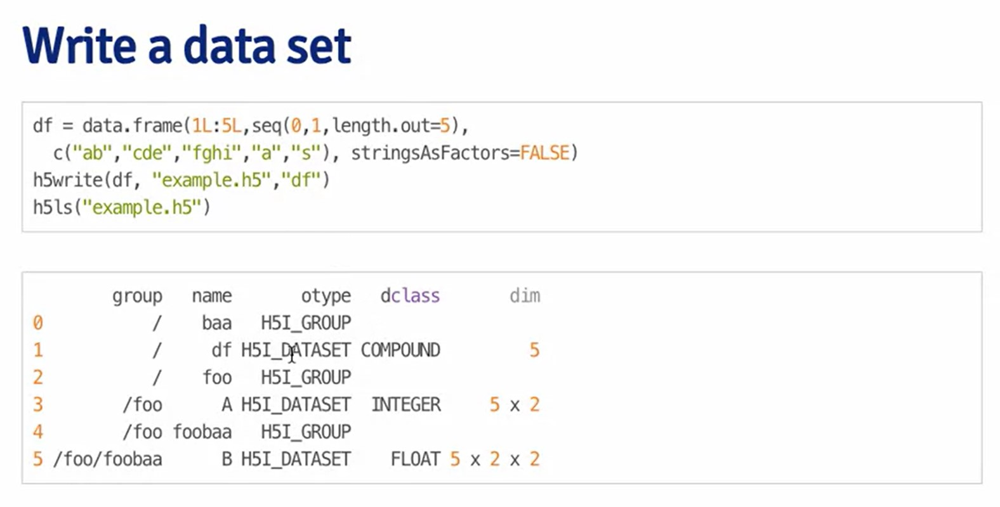
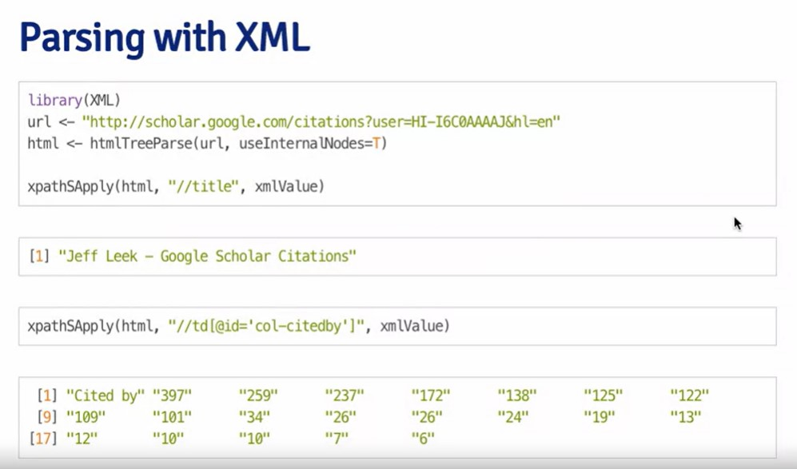
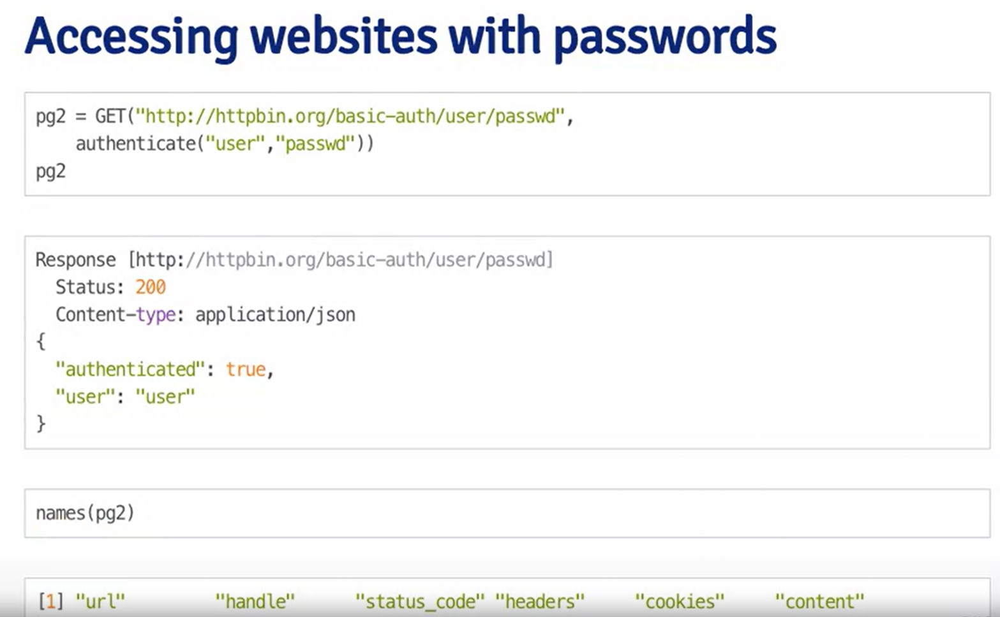
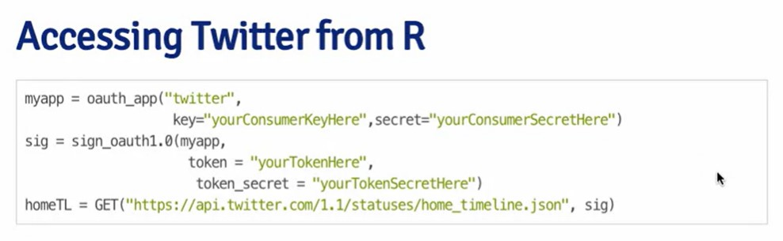
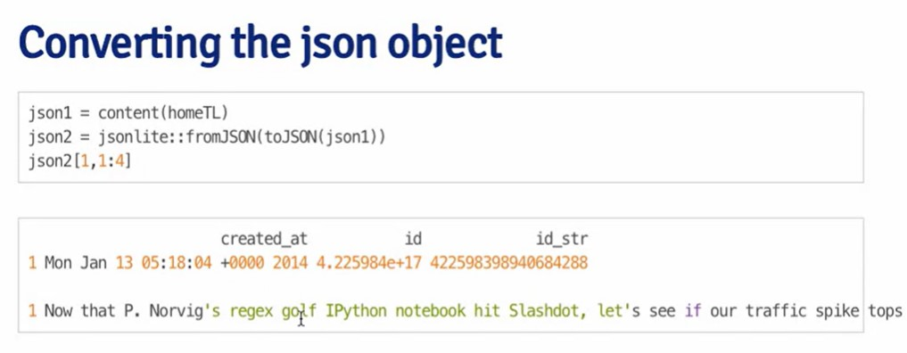
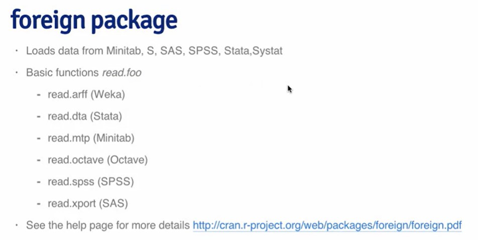
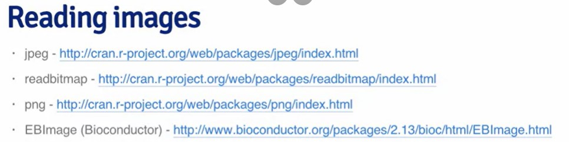
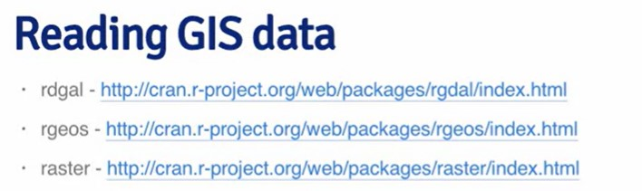
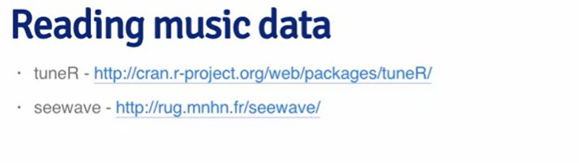

# MYSQL

```{r}
install.packages("RMySQL")
```

```{r}
library(RMySQL)
uscs_DB <- dbConnect(MySQL(), 
                     user = "genome",
                     host = "genome-euro-mysql.soe.ucsc.edu")
result_query <- dbGetQuery(uscs_DB,"show databases;"); dbDisconnect(uscs_DB)
```

```{r}
result_query
```

```{r}
library(RMySQL)
hg19_DB <- dbConnect(MySQL(), 
                     user = "genome",
                     db = "hg19",
                     host = "genome-euro-mysql.soe.ucsc.edu")
hg19_tables <- dbListTables(hg19_DB)
hg19_tables[1:6]
```

```{r}
dbListFields(hg19_DB, "acembly")
```

```{r}
dbGetQuery(hg19_DB, 
           "select count(*) as `Rows count` from acembly")
```

```{r}
acembly_data <- dbReadTable(hg19_DB, "acembly")
```

```{r}
head(acembly_data)
```

```{r}
class(acembly_data)
```

```{r}
query <- dbSendQuery(hg19_DB,
                     "select*from acembly
                     where txStart <= 14362 and
                     txEnd <= 14361")
fetch(query)
#quantile((fetch(query))$txStart)
```

```{r}
# get top 10 results and record it from the executed query
get_fetched <- fetch(query, 
                     n=10);
dbClearResult(query);
```

```{r}
dim(get_fetched)
```

```{r}
dbDisconnect(hg19_DB)
```

# HDF5

*Heirarchical data format* is used to store vast datasets.

All the data about BioConductor installation is availbale on: [link](https://bioconductor.org/install/)

```{r}
if (!require("BiocManager", quietly = TRUE))
    install.packages("BiocManager")
BiocManager::install()
```

```{r}
BiocManager::install("rhdf5")
```

```{r}
library(rhdf5)
created_hdf5 <- h5createFile("./data/h5_file.h5")
created_hdf5
```

Creating groups within the file:

```{r}
created_hdf5 <- h5createGroup("./data/h5_file.h5", "group_1")
created_hdf5 <- h5createGroup("./data/h5_file.h5", "group_2")
created_hdf5 <- h5createGroup("./data/h5_file.h5", "group_1/subgroup_1")
h5ls("./data/h5_file.h5")
```

Writing data to a particular group:

```{r}
matrix_1 <- matrix(1:10, nrow = 5, ncol = 2)
h5write(matrix_1,"./data/h5_file.h5", "group_1/matrix1")
h5ls("./data/h5_file.h5")
```

Writing data to a dataset:

 \# Reading from the Web

Extracting data from the HTMLs of websites.

```{r}
connection <- url("https://stackoverflow.com/questions/33203800/unzip-a-zip-file")
html_code <- readLines(connection)
close(connection)
#html_code
```

Parsing in order of getting pure data without tags:

```{r}
library(XML)
url <- "https://stackoverflow.com/questions/33203800/unzip-a-zip-file"
html_data <- htmlTreeParse(url,
                           useInternalNodes = TRUE)
xpathSApply(html_data,
            "//title")

```

```{r}
library(XML)
library(RCurl)
URL <- "https://stackoverflow.com/questions/33203800/unzip-a-zip-file"
html_parsed <- htmlParse(URL, 
                         useInternalNodes = TRUE)
xpathSApply(html_parsed,
            "//title",
            xmlValue)
```



## Using httr package

> The only way it works!!!!!!

```{r}
install.packages("httr")
```

```{r}
library(httr)
URL <- "https://stackoverflow.com/questions/33203800/unzip-a-zip-file"
html_data2 <- GET(URL)
URL_contents <- content(html_data2,
                        as = "text")
html_parsed <- htmlParse(URL_contents,
                         asText = T)
xpathSApply(html_parsed,
            "//title",
            xmlValue)
```

Authentication



# Reading from APIs

> Using *httr* package

1.  We have to create account of a developer team member.

2.  Create new application

3.  

4.  

```{r}
library(httr)

url <- "https://apidojo-yahoo-finance-v1.p.rapidapi.com/auto-complete"

queryString <- list(
	q = "tesla",
	region = "US"
)

response <- VERB("GET", 
                 url, 
                 query = queryString, 
                 add_headers('X-RapidAPI-Key' = 'SIGN-UP-FOR-KEY', 
                             'X-RapidAPI-Host' = 'apidojo-yahoo-finance-v1.p.rapidapi.com'), 
                 content_type("application/octet-stream"))

content(response, "text")
```

# Reading data from other sources

```{r}
?connections
```

Reading data from the foreign packages:

 

 

# Test

```{r}
library(httr)
oauth_endpoints("github")
```

```{r}
my_app <- oauth_app("github",
                    key = "Iv1.73d3cd9989eef664",
                    secret = "lYi0fQyr2ApHA+aFg1+GA4wKOSecoTxdymKpcNLGemE=")
```

```{r}
github_token <- oauth2.0_token(oauth_endpoints("github"), 
                               my_app)
```

```{r}
reg_token <- config(token = github_token)
req <- GET("https://api.github.com/users/jtleek/repos",
           reg_token)
# stop_for_status(req)
output <- content(req)
```

```{r}
datashare <- which(sapply(output, 
                          FUN=function(X) "datasharing" %in% X))
datashare
```

```{r}
list(output[[15]]$name, output[[15]]$created_at)
```

```{r}
install.packages("sqldf")
```

```{r}
csv_url <- "https://d396qusza40orc.cloudfront.net/getdata%2Fdata%2Fss06pid.csv"
download.file(csv_url,
              destfile = "./data/task_2.csv")
```

```{r}
file1 <- read.csv("./data/task_2.csv")
head(file1)
```

```{r}
library(sqldf)
detach("package:RMySQL", unload = TRUE)
sqldf("select pwgtp1 from file1 where AGEP < 50")
```

```{r}
unique(file1$AGEP)
```

```{r}
sqldf("select distinct AGEP from file1")
```

```{r}
html_url <- url("http://biostat.jhsph.edu/~jleek/contact.html")
html_code <- readLines(html_url)
close(html_url)
```

```{r}
head(html_code)
```

```{r}
res <- c(nchar(html_code[10]),
         nchar(html_code[20]),
         nchar(html_code[30]),
         nchar(html_code[100]))
res
```

```{r}
file2_url <- "https://d396qusza40orc.cloudfront.net/getdata%2Fwksst8110.for"
sst <- read.fwf(file2_url,
                skip = 4, 
                widths = c(12, 7, 4, 9, 4, 9, 4, 9, 4))

```

```{r}
head(sst)
```

```{r}
sum(sst[,4])
```
