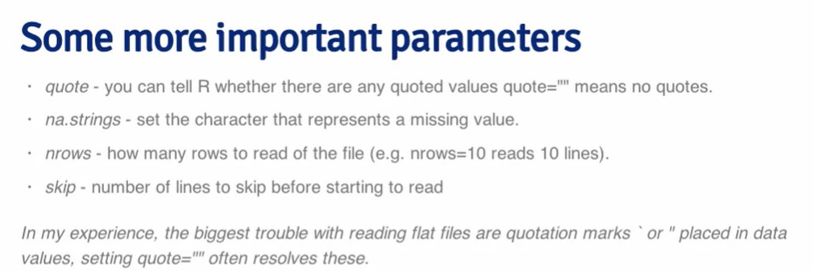
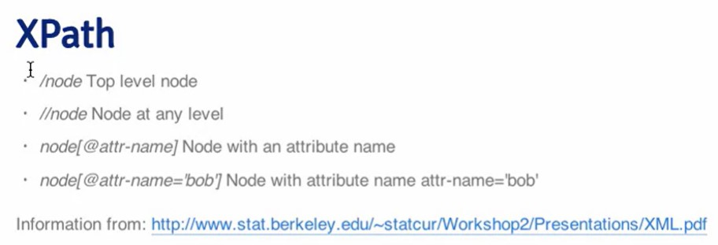
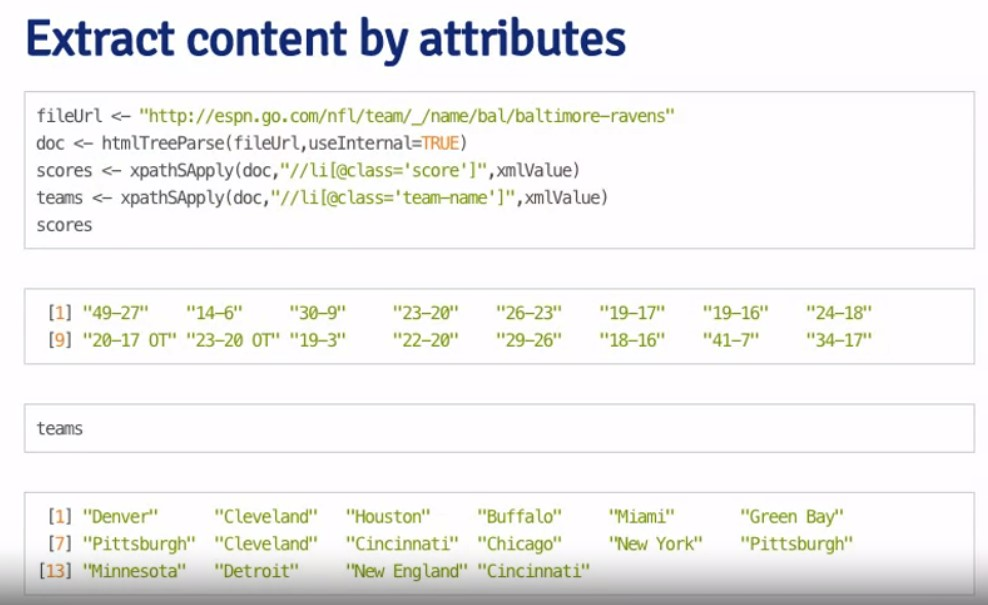
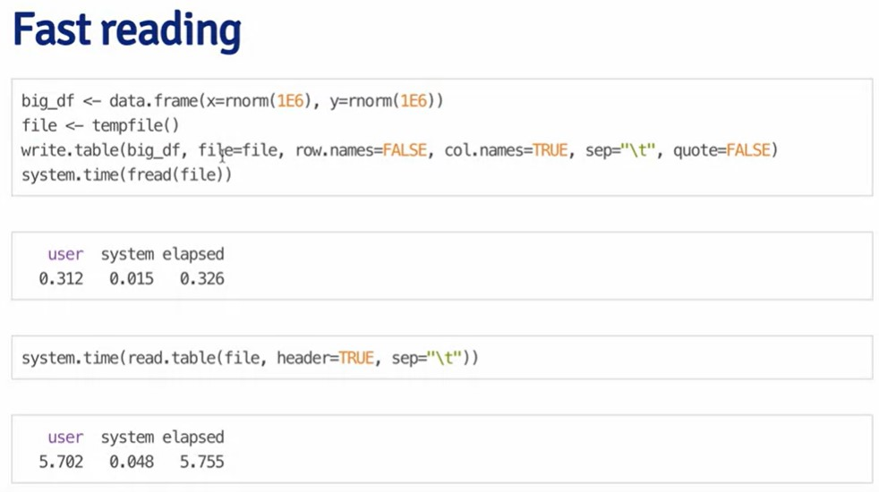

# Raw and processed data

## Downloading files

Let's try checking if the directory exists. If not, creating it:
```{r}
if(!file.exists("data")){
        dir.create("data")
}
```

***

### Get data from the Internet using download.file()

Can be used with urls started with *http* and *https*.

```{r}
# it is not a valid type of link, it should include DOWNLOAD
df_url <- "https://data.baltimorecity.gov/datasets/baltimore::environmental-citations/explore"
download.file(df_url,
              destfile = "./data/environmental_citations.csv",
              # url is HTTPS so curl
              method = "curl")
list.files("./data")
```
To check download version by data:
```{r}
date_downloaded <- date()
date_downloaded
```

***

## Read local files

```{r}
df_emp <- read.table("./data/Baltimore_City_Employee_Salaries.csv",
                     sep = ",",
                     header = TRUE,
                     fill = TRUE)
head(df_emp)
class(df_emp)
```

Using read.csv sets sep ",", header = TRUE
```{r}
df_emp <- read.csv("./data/Baltimore_City_Employee_Salaries.csv")
class(df_emp)
```
Downloading file parameters:



***

## Excel tables

```{r}
library(xlsx)
df_str <- read.xlsx("./data/street_centre.xlsx",
                    sheetIndex = 1,
                    header = TRUE)
```
```{r}
head(df_str)
date()
```

Reading specific rows/cols:
```{r}
cols <- 1:4
rows <- 1:10
df2 <- read.xlsx("./data/street_centre.xlsx",
                    sheetIndex = 1,
                    header = TRUE,
                 colIndex = cols,
                 rowIndex = rows)
df2
```


***

## Reading XML


[https://www.w3schools.com/xml/xml_examples.asp](**XML docs examples**)

To store structured data.
Contains markup (structure) and contents itself.

```{r}
install.packages("XML")
```

```{r}
library(XML)
library(RCurl)
plant_XML_URL <- "https://www.w3schools.com/xml/plant_catalog.xml"
data <- getURL(plant_XML_URL)
xml_parsed_plant <- xmlParse(data)
```


```{r}
root_node <- xmlRoot(xml_parsed_plant)
xmlName(root_node)
```
```{r}
names(root_node)
```
Access to the parts of the XML documents itself
```{r}
root_node[[1]]
```
```{r}
root_node[[1]][[1]]
```
```{r}
root_node[[1]][[2]]
```
Extract different parts of the XML:
```{r}
xmlSApply(root_node,
          xmlValue)
```
### XPath



Get the names of the plants

```{r}
plant_names <- xpathSApply(root_node, 
            "//COMMON",
            xmlValue)
class(plant_names)
plant_names
```
```{r}
plant_prices <- xpathSApply(root_node, 
            "//PRICE",
            xmlValue)
plant_prices

```
Create a Data Frame of it :)
```{r}
plant_df <- data.frame(plant = plant_names,
                       price = plant_prices)
```
```{r}
plant_df
```

We can also extract data from any webpage using these methods:


***

## Reading JSON

```{r}
install.packages("jsonlite")
```

```{r}
library(jsonlite)
data_json <- fromJSON("./data/example_2.json")
# top-level variables
names(data_json)
```
```{r}
# levels by $
names(data_json$quiz$maths)
```
> We can turn Dataset to JSON file!

```{r}
iris_JSON <- toJSON(iris,
                    pretty = TRUE)
# cat() to see the structure of the file 
#cat(iris_JSON)
```

> And we can reverse: turn JSON to dataframe

```{r}
iris_from_json <- fromJSON(iris_JSON)
head(iris_from_json)
```

***

## *data.table* package

All functions that accept *data.frame* are accepted by *data.table*.

> It is faster!

```{r}
install.packages("data.table")
```


Create and see top values:
```{r}
set.seed(1)
library(data.table)
dt <- data.table(x = rnorm(9),
                 y = rep(c("a", "b", "c"),each = 3),
                 z = rnorm(9, 3))
head(dt, 4)
```

Data tables in memory:

```{r}
tables()
```

```{r}
# second row, two cols
dt[2, c(1:2)]
```
```{r}
dt[dt$y == "b",]
```

Calculations:
```{r}
dt[, list(mean = mean(x), 
          sum = sum(z))]
```
```{r}
dt[, table(y)]
```

Add new columns:

```{r}
dt[, new_col:=((z+x)/2)]
dt
```

Multiple operations in a row:

```{r}
dt[, new_col2:= {tmp <- x*z; log2(tmp + 10)}]
dt
```

Compare:

```{r}
dt[, greater_than_zero:= x > 0]
dt
```
```{r}
# aggregated mean
# group by y
dt[, expr:= mean(x + z), by = y]
dt
```

# We can count the number of occurencies using **.N** operator:

```{r}
set.seed(111)
letters_dt <- data.table(x = sample(letters[1:5], 1E3, TRUE))
letters_dt[, 
           .N,
           by = x]

```

### Keys

The other way of optimization is setting a *key* to sort and finding subsets more rapidly.

```{r}
set.seed(111)
letters_dt1 <- data.table(x = sample(letters[2:6], 5, TRUE),
                          z = sample(letters[7:11], 5, TRUE))
letters_dt2 <- data.table(x = sample(letters[1:5], 5, TRUE),
                          y = sample(letters[6:10], 5, TRUE))
class(letters_dt1)
setkey(letters_dt1, x)
letters_dt1['b']

```
Merging:
```{r}
setkey(letters_dt1, x); setkey(letters_dt2, x)
merge(letters_dt1, letters_dt2)
```

***

## Fast reading 




#Test 1

```{r}
dt_url <- "https://d396qusza40orc.cloudfront.net/getdata%2Fdata%2Fss06hid.csv"
download.file(dt_url,
              destfile = "./data/com_syrvey_usa.csv",
              method = "curl")
```
```{r}
dt_survey <- data.table(read.table("./data/com_syrvey_usa.csv",
                     sep = ",",
                     header = TRUE,
                     fill = TRUE))
head(dt_survey)
class(dt_survey)
```

```{r}
dt_survey[VAL == 24, .N]
```

```{r}
dt_fes <- data.table(dt_survey$FES)
dt_fes
```

```{r}
library(xlsx)
xlsx_path <- "./data/getdata_data_DATA.gov_NGAP.xlsx"
dt_xlsx <- data.table(read.xlsx(xlsx_path,
                                sheetIndex = 1,
                                header = TRUE))
dt_xlsx[,]

```

```{r}
cols <- 7:15
rows <- 18:23
dat <- read.xlsx(xlsx_path,
                 sheetIndex = 1,
                 header = TRUE,
                 colIndex = cols,
                 rowIndex = rows)
```

```{r}
sum(dat$Zip*dat$Ext, 
    na.rm = T)
```

```{r}
library(XML)
library(RCurl)
XML_path <- "https://d396qusza40orc.cloudfront.net/getdata%2Fdata%2Frestaurants.xml"
data <- getURL(XML_path)
xml_parsed_restaurants <- xmlParse(data)
```


```{r}
root_node <- xmlRoot(xml_parsed_restaurants)
xmlName(root_node)
```


```{r}
rest_zipcode <- data.table(xpathSApply(root_node,
                            "//zipcode",
                            xmlValue))
rest_zipcode
```

```{r}
names(rest_zipcode)
```


```{r}
rest_zipcode[ V1 == 21231, .N]

```

