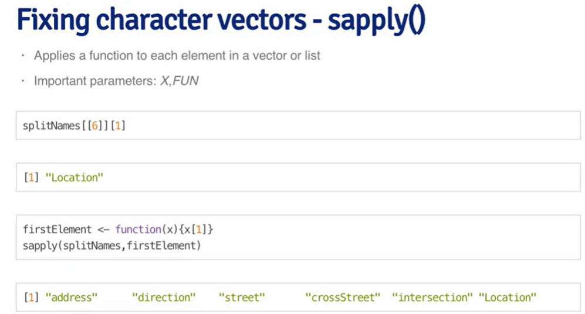
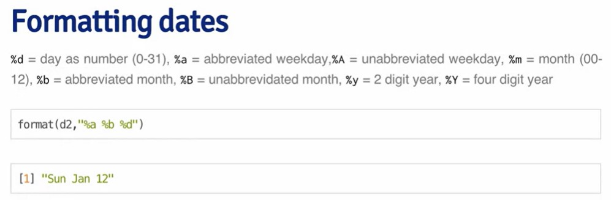
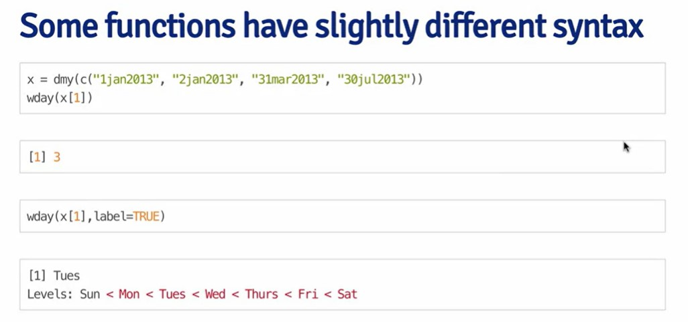

# Editing text variables

Convert letters to lowercase:

`tolower(names(df))`

And to uppercase - `toupper()`

Remove symbols from names using `strsplit()`

```{r}
str <- "name.com"
splitted_str <- strsplit(str, "\\.")
splitted_str
```

From the dataframe names:

```{r}
iris_df <- iris
splitted_header <- strsplit(names(iris_df), "\\.")
splitted_header
```

Also, we can remove specific symbols from the names and substitute it by the needed ones.

```{r}
iris2 <- iris
#tolower(names(iris2))
names(iris2) <- sub("\\.", "_", tolower(names(iris2)),)
iris2
```

To replace multiple symbols, use `gsub()`.

```{r}
str_test <- "This_is_test"
str_test <- gsub("_", "", str_test)
str_test
```



# Finding specific values in the dataframe

Indexes of the elements:

```{r}
grep("setosa", iris2$species)
```

Statistics:

```{r}
table(grepl("setosa", iris2$species))
```

Taking a subset of setosa parameters:

```{r}
setosa_df <- iris2[grepl("setosa", iris2$species),]
```

```{r}
setosa_df
```

Return values find:

```{r}
grep("setosa", iris2$species, value = T)
```

Check the number of specific occurencies:

```{r}
length(grep("setosa", iris2$species))
```

# String functions

```{r}
install.packages("stringr")
```

```{r}
library(stringr)
str_test <- "This_is_test"
nchar(str_test)
```

```{r}
substr(str_test, 1, 5)
```

```{r}
str_test_2 <- "test_2"
paste(str_test, str_test_2)
```

Paste strings with no space between them:

```{r}
paste0(str_test, str_test_2)
```

```{r}
str_trim(string = str_test)
```

```{r}
?str_trim
```

# Regular expressions

Metacharacter representing the start of the line:

`^i some_phrase`

End of the line:

`line$`

Set the the symbols sets to find all that matches at one word:

`[Bb][Rr][Qq]`

```{r}
str_test_3 <- "barbeque was a good idea"

```

Combine starting and the following:

`^[Ii] am`

We can simply set the range of letters or numbers ***without*** paying attention to the order:

`^[0-9][a-zA-Z]`

Finding the sentences that ***NOT ending with ? or .:***

`[^?.]$`

Dot ***"."*** means any character:

`9.11`

***Or*** "\|" expression:

`9|11`

Combining the prev rules (good - at the beginning, but bad not):

`^[Gg]ood|[Bb]ad`

Optional part is followed by ***()?***:

`([Ww]\.)?`

> we add ***"\\"*** not to consider as metacharacter

Example:

`` ^[Ii] (`m | am) (good | bad)? ``

Repeat any number of times ***\*, including none***:

`.*`

***At least one*** selected item ***+***:

`one + two`

Look for something in parenthesis ***():***

`(.*)`

Look for the number separated by character and any other number:

`[0-9]+ (.*)[0-9]+`

Specify the minimun and maximum times to match the expression (Word plus space, something not a space, space between one and 5 times and a specific word ):

`[Ww]ord( +[^ ]+ +){1,5} word2`

m but not more than n matches:

`{m,n}`

exactly m matches:

`{m}`

At least m matches:

`{m,}`

Example:

Space followed by at least one character, at least one space and exact the same match as was found in parenthesis (two or more the same words, repetititon)

`+([a-zA-Z]+) +\1 +`

Look for the longest possible that satisfies the expression, e.g. here we're looking for the string starting with s, followed by the some set of symbols, and then by s.

`^s(.*)s`

Look for the shorter part, and s at the end of the string.

`^s(.*?)s$`

# Dates

Full date-time (it's a character):

```{r}
today <- date()
class(today)
today
```

Just date (it's a date class):

```{r}
sys_date <- Sys.Date()
class(sys_date)
sys_date
```

## Reformat date



Apply it:

```{r}
format(sys_date,
       "%a %b %d %Y")
```

We can create dates out of character vectors:

```{r}
date_vector <- c("1jan2001",
                 "1jul2001",
                 "31dec2014")
dates <- as.Date(date_vector,
                 "%d%b%Y")
dates
```

Time difference:

```{r}
dates[3] - dates[1]
```

As numeric value of days:

```{r}
as.numeric(dates[3] - dates[1])
```

Other functions:

```{r}
weekdays(dates)
```

```{r}
months(dates)
```

```{r}
julian(dates)
```

## Lubridate package

```{r}
install.packages("lubridate")
```

```{r}
library(lubridate)
ymd("20211111")
```

```{r}
mdy("11-11-2021")
```

```{r}
dmy("11/11/2021")
```

```{r}
Sys.timezone()
```

```{r}
ymd_hms("2021-11-11 22:12:09",
        tz = "Europe/Kiev")
```




# Test
#Q1
```{r}
url1 <- "https://d396qusza40orc.cloudfront.net/getdata%2Fdata%2Fss06hid.csv"
download.file(url1, "./data/survey_1.csv")


```

```{r}
df1 <- read.csv("./data/survey_1.csv")
head(df1)
```

```{r}
names(df1) <- tolower(names(df1))

```
```{r}
head(df1)

```

```{r}
q1_colnames <- names(df1)
strsplit(q1_colnames, "^wgtp")[[123]]
```

# Q2-3
```{r}
url2 <- "https://d396qusza40orc.cloudfront.net/getdata%2Fdata%2FGDP.csv"
download.file(url2,
              "./data/survey_2.csv")

```

```{r}
df2 <- read.csv("./data/survey_2.csv")
head(df2)
```

```{r}
df2 <- df2[-c(1:4), ]
head(df2)
```
```{r}
df2 <- df2[-c(191:nrow(df2)),]
nrow(df2)
head(df2)
```

Work on the colnames

```{r}
names(df2) <- gsub("\\.", "_", tolower(names(df2)),)
head(df2)
```

```{r}
df2$x_3 <- gsub(",", "", df2$x_3)
head(df2)
```

```{r}
str(df2$x_3)
```
```{r}
df2$x_3 <- as.integer(df2$x_3)
```


```{r}
mean(df2$x_3, na.rm = T)
```
```{r}
df2$x <- as.character(df2$x) 

df2$x[grep("^U", df2$x)]
```

# Q4
```{r}
url_base <- "https://d396qusza40orc.cloudfront.net/getdata%2Fdata%2FGDP.csv"
url_test <- "https://d396qusza40orc.cloudfront.net/getdata%2Fdata%2FEDSTATS_Country.csv"
download.file(url_base,
              "./data/base_data.csv")
download.file(url_test,
              "./data/test_data.csv")
```

```{r}
base_df <- read.csv( "./data/base_data.csv")
head(base_df)
train_df <- read.csv("./data/test_data.csv")
head(train_df)
```
```{r}
base_df <- base_df[-c(1:4),]
head(base_df)
```

```{r}
nrow(base_df)
nrow(train_df)
```
```{r}
# find common
intersect(as.character(names(base_df)), as.character(names(train_df)))
```
```{r}
merged_df <- merge(base_df, train_df,
                   by.x = "X",
                   by.y = "CountryCode")
head(merged_df)
nrow(merged_df)
```

```{r}
fiscal_year_end_june <- data.frame( fiscal_year_end = merged_df$Special.Notes[grep("^[Ff]iscal year end: June", merged_df$Special.Notes)])
```
```{r}
class(fiscal_year_end_june)
nrow(fiscal_year_end_june)
```
```{r}
fiscal_year_end_june
```

# Q5

```{r}
install.packages("quantmod")
```
```{r}
library(quantmod)
amzn <- getSymbols("AMZN",
                   auto.assign = F)
sampleTimes <- index(amzn)
```
```{r}
library(lubridate)
amzn_2012 <- sampleTimes[grep("^2012", sampleTimes)]
NROW(amzn_2012)
```

```{r}
NROW(amzn_2012[weekdays(amzn_2012) == "Monday"])
```

